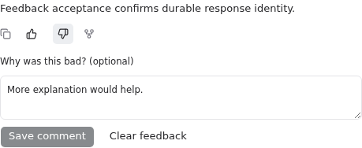
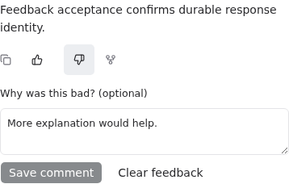

# Response feedback

Completed assistant answers expose thumbs beside Copy/Fork. Selecting a rating saves immediately. The optional comment uses an explicit Save button; Clear feedback removes only the current caller's rating/comment. Failed writes retain the last confirmed state and show an error; unsaved comment text stays editable.

## API and persistence

- `GET /v1/sessions/{session_id}/response-feedback` requires READ and returns only the caller's rows.
- `PUT /v1/sessions/{session_id}/response-feedback/{response_id}` requires EDIT and accepts `{"rating": 1}` or `{"rating": -1, "comment": "Why"}`. Omitted comments are preserved; explicit `null` clears them. Comments are limited to 4,000 characters.
- `DELETE` at the same response URL requires EDIT and is idempotent.

`response_feedback` belongs to `ConversationBase`. Its primary key is `(workspace_id, conversation_id, response_id, user_id)`; local mode uses the existing non-null `local` sentinel. Ratings have a database CHECK constraint. Creation/update timestamps are Unix microseconds. Repeated identical PUTs retain both timestamps. The existing conversation lock serializes upserts across supported databases. Deleting a session cleans up its feedback; forks do not copy another response's feedback.

The store validates a completed assistant message in that session before writes, excluding hidden meta and interrupted messages. UI eligibility additionally excludes streaming, failed, incomplete, continued/process-only bubbles, synthetic cards and non-durable text. This change collects data only and does not affect routing or training.

Migration `f8a9b0c1d2e3` follows the 0.13.0 baseline head `ge1b2c3d4e5f`. Downgrading drops the feedback table and its data. Existing transcript tables are unchanged. Split conversation databases acquire the table through the existing ConversationBase schema initialization.

## Analysis joins

The response key joins to existing transcript/routing events without copying telemetry:

```sql
SELECT f.response_id, f.rating, f.comment, i.type, i.data
FROM response_feedback AS f
JOIN conversation_items AS i
  ON i.workspace_id = f.workspace_id
 AND i.conversation_id = f.conversation_id
 AND i.response_id = f.response_id
WHERE f.conversation_id = :conversation_id;
```

Conversation IDs use the existing binary UUID storage representation; bind through the ORM when using external string IDs. Session metadata is available through `ConversationStore.get_conversation`, including its decoded `session_usage`. In split-DB deployments, join operational metadata at the application layer by workspace/conversation. Session totals are not per-response costs. Missing provider/routing/effort fields remain unknown.

## Original 0.9.0 development acceptance

The screenshots and acceptance JSON below describe the original 0.9.0 implementation, not RTX deployment acceptance.

A real Codex-native answer was generated by a temporary server, host and database. Its existing `codex_...` response ID was rated through the API, then switched and commented in the real chat UI. Tab/Enter saved the comment. Reload retained it. A fresh server process opened the same temporary DB and returned the same response ID, rating and comment. The SQL join recovered the original assistant item and `codex-native-ui` agent; existing session usage named `gpt-5.6-luna`.

[Sanitized acceptance record](acceptance.json).

Desktop:



390px mobile viewport:



These are browser viewport checks, not physical-phone acceptance. Smart Routing/O3 was not exercised because the disposable server had no configured routing lane. No production database/service was changed.

## Reproduce

From the feature worktree with dependencies installed:

```bash
uv run pytest tests/stores/test_response_feedback.py tests/server/routes/test_response_feedback.py -q
cd web
pnpm exec vitest run src/components/ResponseFeedbackActions.test.tsx src/lib/renderItems.test.ts
pnpm exec tsc -b
pnpm build
```

For a real native test, with an authenticated Codex CLI on PATH:

```bash
OMNIGENT_E2E_CODEX_NATIVE=1 uv run pytest tests/e2e/test_response_feedback_native.py -q
```

In an isolated development UI, generate an answer, select either thumb, edit and save the comment, switch polarity, and reload. Confirm the same selection/comment returns. Clear feedback and reload to confirm removal. Repeat at a narrow mobile viewport and activate the buttons with Tab/Enter/Space. User messages, streaming answers and routing cards should have no thumbs.

## RTX 0.13.0 forward-port validation

Source validation runs on VM 100 `rtx-omnigent`, in
`/home/hermes/workspace/worktrees/omnigent/response-feedback-162-rtx`, based on
`b124220d9bc8ee39bbf31e29520661936b6166cf`. The existing implementation and
resolved forward-port were transferred intact; installed release trees are not
source workspaces. Deployment is paused and the active release is unchanged.

Backend/store validation has 310 passes and one existing skip.
The real native-answer feedback test passes against a disposable RTX test
server/database. Frontend regression validation has 685 passes and one existing
routing-eligibility failure (`ChatPage.test.ts:1740`), reproduced on the exact
unchanged baseline (174 passes and the same failure). Scoped pre-commit,
including Ruff, Pyrefly, oxlint and TypeScript, and the production web build pass.
This is source validation, not live deployment or physical-phone acceptance.
