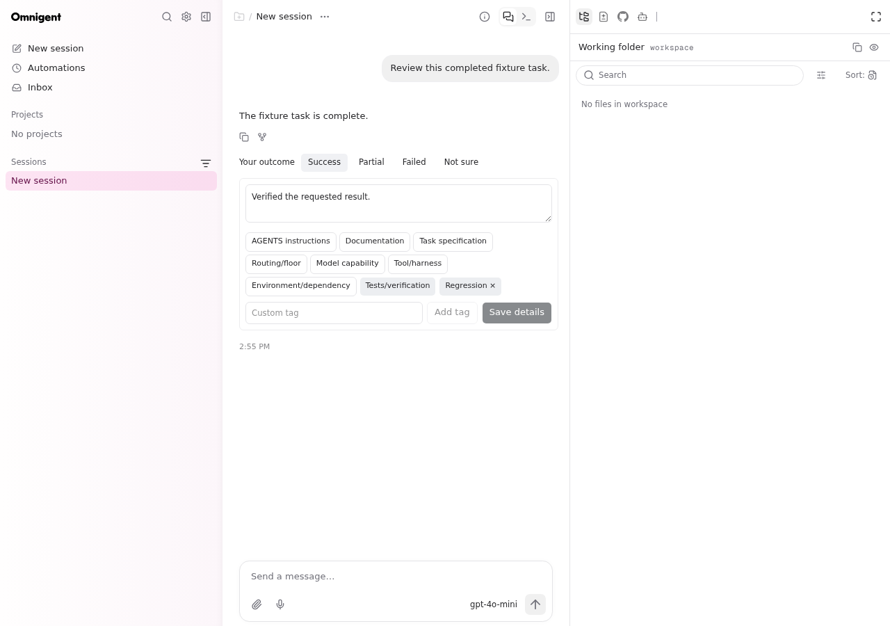

# TB4 hardening audit — 2026-09-17

This is source hardening, not O1/O2 adoption approval. No deployment, service
restart, runtime upgrade, production database edit, or credential change was
performed. GitHub was checked before work: Omnigent draft #167 was
`3d2ecdf44f410fa3e61bf2afbf81aa1e972284d2`, based on `codex/rtx-peer-v2`;
companion draft #5 was `8f97e95cfd2acc5eae7264c8604c3bbca906c0ce`.

## Changes

- Reapply immutable TB4 treatment after approval catalogue refresh and before
  constructing a Combo. Legacy evaluations cannot rescue an excluded TB4
  configuration, including run-anyway. Tool-free options are intersected with
  the exact admitted set. Repeated approval validates the retained route/Combo.
- Refuse a fixed reasoning configuration that differs from the requested
  execution configuration. Missing, ambiguous, and invalid evidence fails closed.
- Reserve the independent floor adviser in a SQLite ledger before inference.
  Identical requests share one durable result. Conflicting requests fail.
  Pending/interrupted assignment cannot execute or silently run the adviser
  again. Proposal JSON read/modify/write has a process lock; treatment fields
  cannot be overwritten or status regressed by stale writes.
- The composer persists a logical attempt identity across proposal-POST retries.
  Legacy proposals lacking that identity must be recreated to enter this
  experiment. Image attachments supply deterministic input metadata; adviser
  inference and manual overrides cannot remove that vision requirement.
- Outcome changes save the current comment and selected/custom tags with the
  new append-only human revision. Model review remains a separate record.
- The terminal hook is the sole review scheduler; the atomic claim remains.
  Automated review now returns before connecting, forking, or issuing inference.
  This is a deliberate fail-closed restriction, not a successful review.
- Backend lookup no longer chooses the latest call. It requires an explicit
  previously bound call-log identifier and checks its route/time window. Missing
  binding yields no attribution. Missing connection identity remains null.

## Codex protocol findings

The repository CI dependencies pin `@openai/codex=0.139.0` (lockfile and CI
workflows). Both live RTX host process environments resolve `/usr/local/bin/codex`
without an `OMNIGENT_CODEX_PATH` override; that executable reports `0.153.4`.
A separate manual CLI 0.154.0 exists but is not that host resolution.

Source references:

- [0.139 client](https://github.com/openai/codex/blob/rust-v0.139.0/codex-rs/core/src/client.rs)
  uses the thread ID absent an override (lines 367–378).
- [0.139 Guardian](https://github.com/openai/codex/blob/rust-v0.139.0/codex-rs/core/src/guardian/review_session.rs)
  scopes its special key to `guardian:<parent>`; this is not a generic fork
  promise, nor proof of a hit on the primary task's cache.
- [0.153.4 client](https://github.com/openai/codex/blob/rust-v0.153.4/codex-rs/core/src/client.rs)
  instead uses Responses metadata `session_id` for normal sessions (lines
  540–553). The actual executable's generated `Thread` schema describes
  `sessionId` as shared by a session tree. This is a materially different
  implementation from the pin and warrants a wire-level generic-fork test.
- The actual 0.153.4 generated `ThreadForkParams`, `TurnStartParams`, and
  `ThreadSettingsUpdateParams` schemas contain no explicit all-tools-disabled
  or prompt-cache-key override field. Arbitrary `config` is not evidence that
  an invented setting is supported. The versioned config schema's `tools`
  section does not provide an all-tools switch.

No verified supported configuration currently establishes prevention of every
inherited native, MCP, app, and web tool for this reviewer. A read-only sandbox,
`approvalPolicy=never`, and detecting `item/completed` are insufficient. The
unsafe launch path was removed. No installed runtime was patched.

`prompt_cache_lineage_verified` remains null. Source-level session identity is
not a measured cache hit. The parser preserves input/output/reasoning/cache-read/
cache-write counters; absent counters are null, an explicit zero cache read is
false, and positive cached-input tokens are the only hit evidence.

## OmniRoute 3.8.43 findings

The companion branch still pins 3.8.43. The published npm 3.8.43 package was
inspected separately, with integrity:

`sha512-Mss0iiFi7aZXodC4JhaGJAyBZ6c/cyYRERmmVqDB8x2FzIlYqF7GR4xbhVJWi0B8YNFJyeYYX2+Vl2gEDtDUnQ==`

In that package, `src/sse/handlers/chat.ts:318` reads the request header
`x-omniroute-connection`; direct-route dispatch passes it as
`forcedConnectionId` (line 817). `src/sse/services/auth.ts:1109` filters to that
connection; forced-connection paths suppress fallback to another account.
Thus account selection support exists in 3.8.43 at the request layer. Merely
selecting a direct model route does not engage it. Per-fork header integration
has not been implemented or wire-tested; exact backend affinity is not claimed.
No single-target evaluator Combo or global routing setting was added.

Live RTX inspection found its service running **3.8.50-attempt-v1**, not the
companion's 3.8.43 pin. That newer runtime cannot validate the pinned contract.
The companion's `scripts/verify-patches.sh` was actually run on the source host
and failed because its documented 3.8.43 runtime path is absent. No runtime was
installed or repaired to make this check appear green. Companion source remains
unchanged.

## Verification and reproducibility

Run from the isolated Omnigent source worktree:

```sh
uv run --no-sync pytest tests/test_codex_native_self_review.py \
  tests/test_codex_native_self_review_affinity.py \
  tests/test_codex_native_terminal_review_hook.py \
  tests/server/test_o3_*.py tests/server/routes/test_task_experiment.py \
  tests/stores/test_task_experiment.py tests/inner/test_codex_native_executor.py -q
uv run --no-sync pyrefly check
uv run --no-sync pytest tests/e2e_ui/chat/test_task_outcome_edits.py -q
cd web
pnpm exec vitest run src/components/ResponseFeedbackActions.test.tsx \
  src/components/RoutingProposalCard.tb4.test.tsx src/lib/o3RoutingReview.test.ts \
  src/shell/NewChatDialog.flow.test.tsx
pnpm run lint
pnpm run type-check
pnpm run build
```

The browser test creates an isolated server/database, seeds a completed fixture
answer without inference, edits comment/tags, changes the outcome, and verifies
persistence after reload. It is not a provider-backed acceptance test.

## Results

| Check | Result |
| --- | --- |
| Required backend suites plus O3/approval/native executor suites | 254 passed, 0 failed |
| Approval suite rerun after repeated-approval validation | 58 passed, 0 failed |
| Four focused frontend suites | 78 passed, 0 failed |
| Isolated browser/server outcome-edit test | 1 passed, 0 failed |
| Companion offline O3 suites | 42 passed, 0 failed |
| Assignment/approval rerun after final ledger cleanup | 91 passed, 0 failed |
| Pyrefly | 0 errors |
| Ruff check / format check and staged pre-commit | passed |
| Web lint / type check / production build | passed |
| Companion installed-runtime verification | failed: documented runtime absent |
| OpenAI / non-OpenAI provider-backed reviewer acceptance | not run; reviewer fails closed |

Earlier setup/test failures were corrected: missing `pnpm` on the test process
PATH, stale DOM references after outcome-editor remount, and O3 fixture data
predating the mandatory TB4 gate. Draft-skipped Actions wrappers are not counted
as test execution.



## Remaining adoption blockers

1. Prove a supported tool-free fork contract before restoring automated review.
2. Implement and persist the end-to-end logical attempt → primary thread/turn →
   OmniRoute request/call-log join. Requiring a bound ID removes the unsafe
   heuristic but does not create this missing instrumentation. Full primary
   actual-effort and token attribution remains incomplete.
3. Verify generic-fork cache-key behavior on the exact supported deployed Codex
   version, retaining actual cached-input counters. The CI/runtime mismatch
   must be reconciled separately; no upgrade is authorized here.
4. Integrate and test per-review account pinning through the supported request
   header without changing global settings, and verify model/connection
   equality from the correlated request, including fallback/error paths.
5. Perform disposable OpenAI and non-OpenAI native acceptance against a runtime
   matching the accepted contract. This run made no evaluator inference calls:
   same provider/model, same connection, cached-input counts, and cache-write
   counts are **unmeasured**, not false or zero. Prompt-cache lineage is null.
6. Review interrupted assignment reservations operationally. They intentionally
   remain blocked after an owner crash; recovery must not rerun the adviser or
   rerandomize an existing logical experiment.

Do not adopt this draft on O1/O2 until these blockers are resolved.

## Exact changed files

- `docs/task-success-experiment/hardening-audit-2026-09-17.md`
- `docs/task-success-experiment/images/outcome-details-preserved.png`
- `omnigent/harnesses/codex_native/self_review.py`
- `omnigent/harnesses/codex_native/terminal_review_hook.py`
- `omnigent/inner/codex_native_executor.py`
- `omnigent/server/o3_routing_review/floor_assignment.py`
- `omnigent/server/o3_routing_review/models.py`
- `omnigent/server/o3_routing_review/routes.py`
- `omnigent/server/o3_routing_review/service.py`
- `omnigent/server/o3_routing_review/store.py`
- `omnigent/server/o3_routing_review/tb4_floor_experiment.py`
- `tests/e2e_ui/chat/test_task_outcome_edits.py`
- `tests/server/test_o3_routing_review.py`
- `tests/server/test_o3_tb4_floor_experiment.py`
- `tests/test_codex_native_self_review.py`
- `tests/test_codex_native_self_review_affinity.py`
- `web/src/components/ResponseFeedbackActions.test.tsx`
- `web/src/components/ResponseFeedbackActions.tsx`
- `web/src/lib/o3RoutingReview.ts`
- `web/src/shell/NewChatDialog.flow.test.tsx`
- `web/src/shell/NewChatDialog.tsx`
